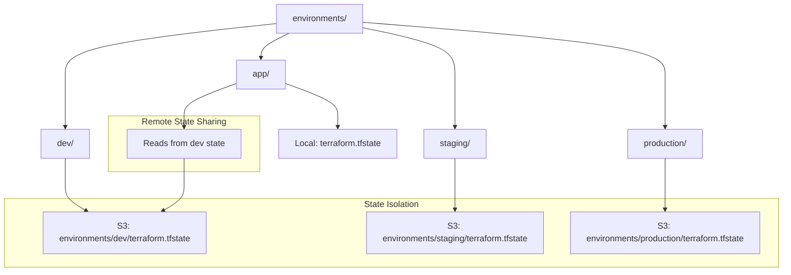

# Terraform 30 Days - Day 1: Benefits of Infrastructure as Code

This project demonstrates Terraform state isolation using file layouts and remote state data sources for multi-environment deployments.

## Architecture Overview



## Project Structure

```
terraform/
├── environments/
│   ├── dev/
│   │   ├── main.tf
│   │   ├── variables.tf
│   │   ├── outputs.tf
│   │   └── backend.tf
│   ├── staging/
│   │   ├── main.tf
│   │   ├── variables.tf
│   │   ├── outputs.tf
│   │   └── backend.tf
│   ├── production/
│   │   ├── main.tf
│   │   ├── variables.tf
│   │   ├── outputs.tf
│   │   └── backend.tf
│   └── app/
│       ├── main.tf
│       ├── outputs.tf
│       └── backend.tf
├── main.tf
├── variables.tf
└── README.md
```

## Key Concepts Demonstrated

### 1. State Isolation via File Layouts
- Each environment (`dev`, `staging`, `production`) has its own directory
- Separate backend configurations pointing to unique S3 state file paths
- Complete isolation: changes in one environment don't affect others

### 2. Remote State Data Source
- The `app` environment demonstrates cross-configuration sharing
- Uses `terraform_remote_state` to read outputs from the `dev` environment
- Shows how to reference resources created in one layer from another

## Prerequisites

- AWS CLI configured with appropriate permissions
- Terraform v1.0+
- S3 bucket: `terraform-up-and-running-state-rommy`
- DynamoDB table: `terraform-up-and-running-locks`

## Usage

### Deploy Individual Environments

#### Dev Environment
```bash
cd environments/dev
terraform init -reconfigure
terraform plan -refresh=false
terraform apply
```

#### Staging Environment
```bash
cd environments/staging
terraform init -reconfigure
terraform plan -refresh=false
terraform apply
```

#### Production Environment
```bash
cd environments/production
terraform init -reconfigure
terraform plan -refresh=false
terraform apply
```

#### App Environment (with Remote State)
```bash
cd environments/app
terraform init -reconfigure
terraform plan -refresh=false
terraform apply
```

### Clean Up
```bash
# From each environment directory
terraform destroy
```

## Environment Details

| Environment | Instance Type | Security Group Name | State File Path |
|-------------|---------------|---------------------|-----------------|
| dev | t3.micro | my-instance-sg-east1-dev | environments/dev/terraform.tfstate |
| staging | t3.small | my-instance-sg-east1-staging | environments/staging/terraform.tfstate |
| production | t3.medium | my-instance-sg-east1-production | environments/production/terraform.tfstate |
| app | t3.micro | N/A (reads from dev) | terraform.tfstate (local) |

## Notes

- The root `main.tf` and `variables.tf` are legacy files from workspace-based approach
- Each environment directory is self-contained with its own backend configuration
- The `app` environment demonstrates the `terraform_remote_state` data source pattern
- State files are stored in S3 with DynamoDB locking for concurrency control
- All environments use the same AWS region (us-east-1) and AMI

## Best Practices Demonstrated

1. **State Isolation**: Separate state files prevent accidental cross-environment changes
2. **Remote State Sharing**: Use data sources to reference outputs across configurations
3. **Environment-Specific Variables**: Each environment has tailored resource configurations
4. **Backend Configuration**: Proper S3 backend setup with locking and encryption